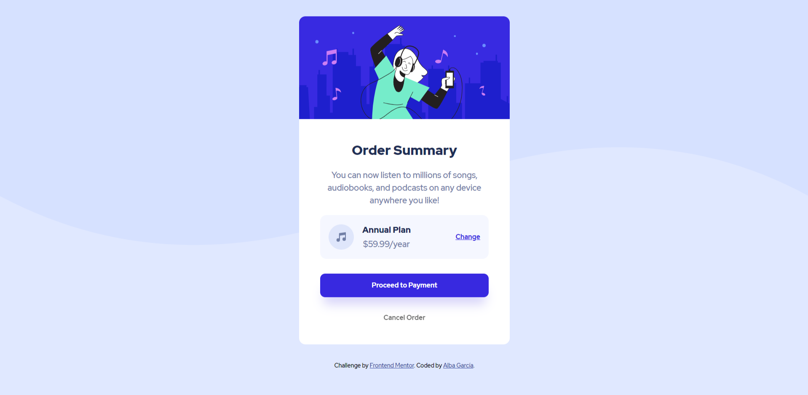

# Frontend Mentor - Order summary card solution

This is a solution to the [Order summary card challenge on Frontend Mentor](https://www.frontendmentor.io/challenges/order-summary-component-QlPmajDUj). Frontend Mentor challenges help you improve your coding skills by building realistic projects. 

## Table of contents

- [Overview](#overview)
  - [The challenge](#the-challenge)
  - [Screenshot](#screenshot)
  - [Links](#links)
- [My process](#my-process)
  - [Continued development](#continued-development)
  - [Useful resources](#useful-resources)
- [Author](#author)

## Overview

### The challenge

Users should be able to:

- See hover states for interactive elements

### Screenshot

### Links

- Solution URL: [Add solution URL here](https://your-solution-url.com)

## My process

### Continued development

Eventhough I've been working on web for some time now, I always feel like I'm missing something, so I'm working on imporving my html and CSS worflow to make it as clean and optimized as I can... Any tip is always welcome!
(And I always forget to start Mobile first...)

### Useful resources

- [Kevin Powell](https://www.youtube.com/kepowob) - I really love his CSS videos and I've been learning a lot with them too!

## Author

- Website - [Alba García](https://koalba.netlify.app/)
- Frontend Mentor - [@koalba](https://www.frontendmentor.io/profile/koalba)
- ArtStation - [Alba García](https://www.artstation.com/koal_art)
- Instagram - [Koal_Art](https://www.instagram.com/koal_art/)

